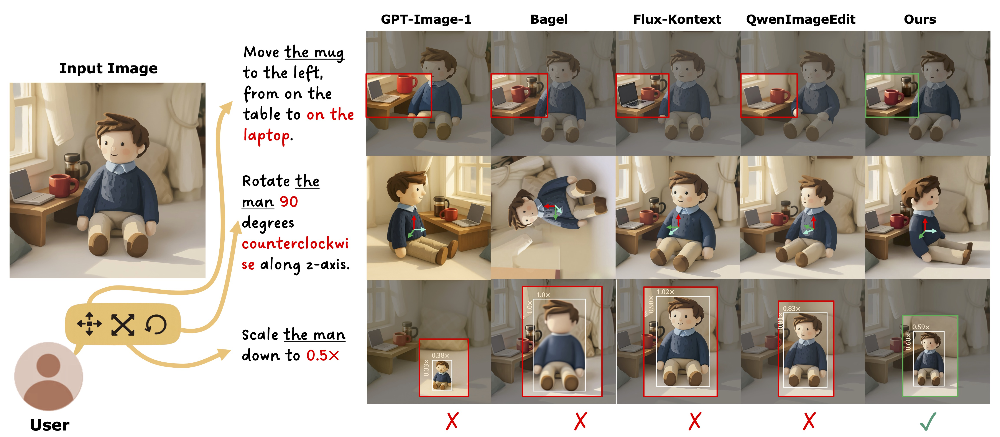

# Talk2Move: Reinforcement Learning for Text-Instructed Object-Level Geometric Transformation in Scenes

[**Project page**](https://sparkstj.github.io/talk2move) | [**Paper**](https://arxiv.org/abs/2601.02356) | [**Video**](https://youtu.be/bVQ3vUxTAmM)


[Jing Tan](https://sparkstj.github.io/), [Zhaoyang Zhang](https://zzyfd.github.io/#/), [Yantao Shen](https://yantaoshen.github.io/), [Jiarui Cai](https://scholar.google.com/citations?user=0na-wa0AAAAJ&hl=en), [Shuo Yang](http://shuoyang1213.me/), [Jiajun Wu](https://jiajunwu.com/), [Wei Xia](https://scholar.google.com/citations?user=OCdJxC8AAAAJ&hl=en), [Zhuowen Tu](https://pages.ucsd.edu/~ztu), [Stefano Soatto](https://web.cs.ucla.edu/~soatto/)


<p align="center">
<a href="https://arxiv.org/abs/2601.02356">"></a>
<a href="https://sparkstj.github.io/talk2move"></a>
<a href="https://youtu.be/bVQ3vUxTAmM"></a>
<a href="" target='_blank'>

</a>
</p>



This repository contains training scripts for Talk2Move, scene-level image editing models using GRPO (Group Relative Policy Optimization). 

In this work, we demonstrate that RLVR can effectively improve prompt-following performance for the corresponding tasks in vision-related settings, and we propose an early stopping strategy that greatly improves the sampling efficiency of flow-based GRPO.

## Licenses
This codebase is build upon:
- Flow-GRPO, which is licensed under MIT license; 
- Orient-Anything that is licensed under CC-BY-4.0 license, 
- lang-segment-anything that is licensed underApache-2.0 license; 
- Grounding-DINO that is licensed under Apache-2.0 license

## Key Modifications
### **Added an object-manipulation reward suite for editing tasks**  
   **Modified file:** `talk2move/rewards.py`  
   - Added new editing-focused rewards: `translation`, `ours_qwenvl` (zero-shot qwenvl scorer), `ours_clip`, `rotation`, `resize`, `lpips`
   - Extended `multi_score` to support editing-task inputs via a new 4-argument path: `images`, `ref_images`, `prompts`, `metadata`.

### **Upgraded the GRPO sampling pipeline from pure SDE to SDE + shortcut ODE**  
   **Modified files:** `grpo/diffusers_patch/qwenimage_edit_pipeline_with_logprob.py`, `grpo/diffusers_patch/sd3_sde_with_logprob.py`  
   - Introduced `ode_shortcut_step` in `qwenimage_edit_pipeline_with_logprob.py`, extending sampling from pure SDE to `SDE + shortcut ODE`.  
   - Added `ode_shortcut_step` in `sd3_sde_with_logprob.py`, which updates latents using continuous-time steps (`t -> t_prev`) and `dt` (instead of the scheduler’s discrete `step+1`), and performs deterministic ODE updates without injecting random noise.

## Setup
### Prerequisites
- Python 3.8+
- PyTorch with CUDA support
- 16 GPUs (2 nodes × 8 GPUs per node)
- Required Python packages (install via `pip install -e .`)

### Configuration

Before running training, update the paths in your configuration:

1. Replace `enter_path_here` placeholders in the codebase with your actual paths
2. Update `MASTER_ADDR` in `scripts/multi_node/qwenimagedit/main.sh` to match your master node IP
3. Ensure all nodes can communicate via the specified master address and port

The training script uses the following default settings:
- **GPUs per node**: 8
- **Number of nodes**: 2
- **Total GPUs**: 16
- **Master port**: 19001
- **Config**: `config/grpo.py:talk2move`

To modify these settings, edit `scripts/multi_node/qwenimagedit/main.sh`.

## Available Configurations

Check `config_files/grpo.py` for available training configurations:

### Qwen-Image-Edit Configurations
- Various task-specific configs for rotation(`talk2move_rotation`), resize (`talk2move_resize`), translation (`talk2move_translation`)

Each configuration specifies:
- Model architecture and checkpoint paths
- Batch sizes and gradient accumulation steps
- Sampling parameters (num_steps, guidance_scale)
- Reward function weights
- Training hyperparameters (learning rate, beta, etc.)


### Running Training (16 GPUs)

To run training on 16 GPUs across 2 nodes (8 GPUs per node):

#### On Node 0 (Master):
```bash
sh scripts/multi_node/qwenimagedit/main.sh 0
```

#### On Node 1 (Worker):
```bash
sh scripts/multi_node/qwenimagedit/main.sh 1
```

## Troubleshooting

- **Connection issues**: Verify that `MASTER_ADDR` is correct and nodes can communicate
- **CUDA out of memory**: Reduce batch size in the config file
- **Path errors**: Ensure all `enter_path_here` placeholders are replaced with valid paths
- **Reward server errors**: Check that reward server IPs (`your-api-server-ip`, `your-reward-server-ip`) are correctly configured
- **Import errors**: Run `pip install -e .` to install the package in development mode
- **NCCL timeout**: Increase timeout or check network connectivity between nodes

## Citation

If you use this code in your research, please cite the relevant papers for the models and methods use
```
@misc{tan2026talk2movereinforcementlearningtextinstructed,
      title={Talk2Move: Reinforcement Learning for Text-Instructed Object-Level Geometric Transformation in Scenes}, 
      author={Jing Tan and Zhaoyang Zhang and Yantao Shen and Jiarui Cai and Shuo Yang and Jiajun Wu and Wei Xia and Zhuowen Tu and Stefano Soatto},
      year={2026},
      eprint={2601.02356},
      archivePrefix={arXiv},
      primaryClass={cs.CV},
      url={https://arxiv.org/abs/2601.02356}, 
}
```

## Contribution
This codebase is built by [Jing Tan](https://sparkstj.github.io/) during her internship at AWS Agentic AI. 

For any question, feel free to contact her via 
```
tj023@ie.cuhk.edu.hk
```